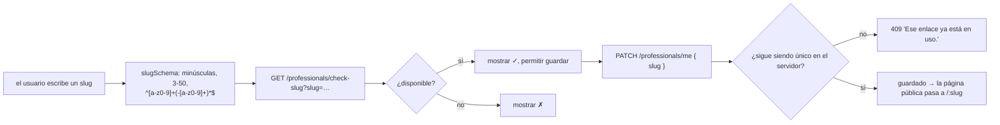

El `Professional` es el único tipo de cuenta. Todo lo demás (servicios,
horario, reservas) cuelga de él.

## Campos del perfil

Se editan en `/dashboard/profile` (`ProfilePage.tsx`), se guardan vía
`PATCH /professionals/me` con un cuerpo **parcial** (`updateProfileSchema` —
todos los campos opcionales).

| Grupo | Campos |
| --- | --- |
| Identidad | `businessName`, `slug`, `category` |
| Marca | `logoUrl`, `coverImageUrl`, `photoUrl`, `brandColor` (hex de 6 dígitos) |
| Texto | `description` (≤ 500) |
| Reglas de reserva | `timezone` (IANA), `cancellationPolicyHours` (uno de `1, 2, 3, 4, 6, 24`) |

`brandColor` se edita con un deslizador de tono (`professionals/color.ts` —
`hueToHex` / `hexToHue`, S/L fijos) más muestras predefinidas
(`BRAND_COLOR_PRESETS`).

Las imágenes se reducen en el navegador (`professionals/image.ts`) y luego se
envían a `POST /upload/image?type=logo|cover`, que devuelve una URL de
Cloudinary que se guarda de vuelta en el perfil.

## Gestión del slug



`check-slug` excluye el slug actual de quien llama, así que volver a guardar un
slug sin cambios lo reporta como disponible.

## Endpoints

| Método | Ruta | Auth | Propósito |
| --- | --- | --- | --- |
| `GET` | `/professionals/me` | JWT | Perfil completo + `bookingsThisMonth` + `serviceCount` + `monthlyBookingLimit` |
| `PATCH` | `/professionals/me` | JWT | Actualización parcial; se revalida la unicidad del slug |
| `GET` | `/professionals/check-slug?slug=` | JWT | `{ available: boolean }` |
| `GET` | `/public/professionals/:slug` | ninguna · `@Throttle 30/60s` | Perfil público + servicios activos |

## Respuesta de `GET /professionals/me`

```jsonc
{
  "id": "uuid",
  "email": "pro@example.com",
  "businessName": "Barbería Central",
  "slug": "barberia-central",
  "category": "Barbería",
  "photoUrl": null,
  "logoUrl": "https://res.cloudinary.com/…",
  "coverImageUrl": null,
  "brandColor": "#4F46E5",
  "description": "…",
  "timezone": "America/Bogota",
  "cancellationPolicyHours": 24,
  "plan": "FREE",
  "bookingsThisMonth": 12,      // reservas no canceladas creadas desde el día 1 (UTC)
  "serviceCount": 3,            // servicios no borrados (para el upsell, sin segundo fetch)
  "monthlyBookingLimit": 100,   // null desde Básico hacia arriba
  "createdAt": "…",
  "updatedAt": "…"
}
```

## Página pública

`GET /public/professionals/:slug` (usada por `PublicBookingPage`) devuelve solo
lo que un cliente debe ver: `businessName`, `slug`, `category`, imágenes,
`brandColor`, `description` y los **servicios activos y no borrados** ordenados
por `sortOrder` — sin email, plan, timezone ni conteos.

## Planes

`Professional.plan`: `FREE` (Gratuito, default) · `BASIC` (Básico) ·
`ADVANCED` (Avanzado) · `BUSINESS` (Negocios). Quien se registra (incl. la
lista de espera) entra en **Gratuito**. No hay cobro todavía: un plan de
pago se asigna en la base.

El catálogo de flags está en `@agendya/types` (`FEATURE_CATALOG`). Hoy se
**aplican** en el servidor solo los límites de servicios y reservas/mes.
El resto (`enforced: false`) sirve para “Te falta” y para ir encendiendo
features sin tocar el enum.

| | Gratuito | Básico | Avanzado | Negocios |
| --- | --- | --- | --- | --- |
| Servicios | 3 | 10 | ilimitado | ilimitado |
| Reservas / mes | 100 | ilimitado | ilimitado | ilimitado |

Migración: el antiguo `BASIC` pasó a `FREE`; el antiguo `PRO` a `ADVANCED`.
