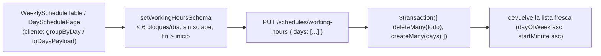
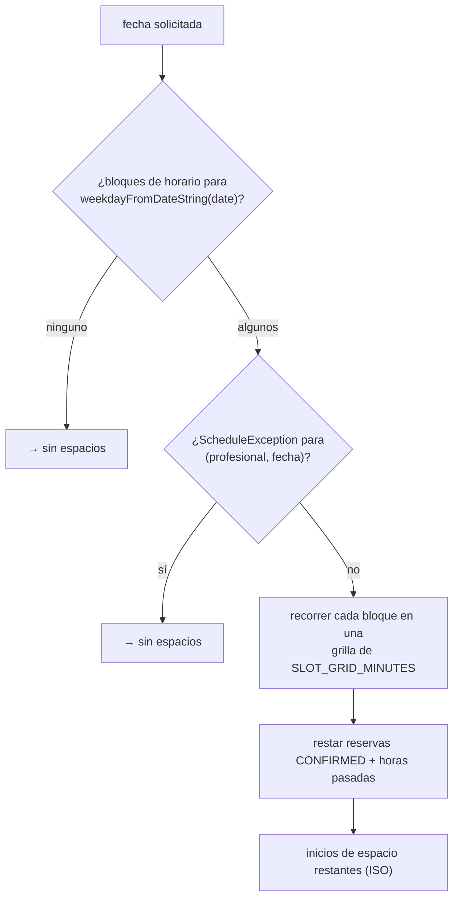

Dos mecanismos independientes deciden cuándo un profesional *podría* recibir una
reserva, antes de restar las reservas existentes:

1. **Horario de atención** — bloques recurrentes semanales (`WorkingHour`).
2. **Excepciones de horario** — fechas cerradas concretas (`ScheduleException`).

Ambos se editan bajo `/dashboard/schedule` (`SchedulePage.tsx`,
`DaySchedulePage.tsx` para un día de la semana, `BlockedDatesManager.tsx`).

## Horario de atención

- Un día de la semana puede tener **hasta 6 bloques** (`MAX_BLOCKS_PER_DAY`),
  cada uno `{ dayOfWeek, startMinute, endMinute }` en minutos desde medianoche.
- Los bloques del mismo día **no deben solaparse** y `endMinute > startMinute` —
  ambos se comprueban en `setWorkingHoursSchema` (`superRefine` de Zod) antes de
  la escritura.
- `PUT /schedules/working-hours` **reemplaza la semana entera** — el servicio
  hace `deleteMany` + `createMany` en un `$transaction`. No hay PATCH por
  bloque.

Helpers de cliente en `schedules/blocks.ts`: `groupByDay`, `toDaysPayload`,
`formatRange`, `formatBlockDuration`, `dayPartLabel` (`Mañana`/`Tarde`/`Noche`),
`blocksOverlap`, `findOverlap`. Orden/etiquetas/slugs de días de la semana en
`schedules/weekday.ts` (lunes primero, etiquetas en español, slugs sin acentos).

## Excepciones de horario

- Una fila por `(professionalId, date)` — la restricción `@@unique` implica que
  un `POST` duplicado devuelve `409 "Ya existe un bloqueo para esa fecha."`
  (Prisma `P2002` mapeado en el servicio).
- `date` es una columna `@db.Date`; el servicio convierte la cadena
  `YYYY-MM-DD` con `dateOnlyUtc()` (medianoche UTC de ese día de calendario).
- Una excepción bloquea el **día entero** sin importar el horario de atención.

| Método | Ruta | Propósito |
| --- | --- | --- |
| `GET` | `/schedules/working-hours` | Listar bloques (`dayOfWeek` asc, `startMinute` asc) |
| `PUT` | `/schedules/working-hours` | Reemplazar la semana entera |
| `GET` | `/schedules/exceptions` | Listar excepciones (`date` asc) |
| `POST` | `/schedules/exceptions` | Agregar `{ date, reason? }` |
| `DELETE` | `/schedules/exceptions/:id` | Eliminar — guarda `findFirst({ id, professionalId })`, `404` si no es propia |

Todos protegidos por JWT.

## Cómo alimenta esto la disponibilidad

Detalles y el algoritmo exacto: [Disponibilidad](/features/availability/).
