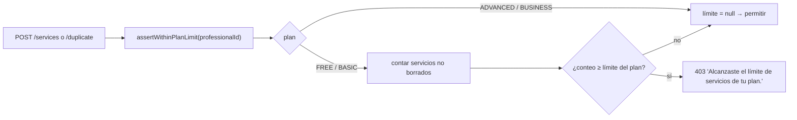

Se gestionan en `/dashboard/services` (`ServicesPage.tsx`) y
`/dashboard/services/new` · `/dashboard/services/:id/edit`
(`ServiceFormPage.tsx`). Todos los endpoints están protegidos por JWT y acotados
a quien llama.

## Campos

| Campo | Regla |
| --- | --- |
| `name` | 2–100 caracteres |
| `description` | ≤ 500 caracteres, opcional |
| `durationMinutes` | entero 5–480; el formulario ofrece una lista fija de opciones (`SERVICE_DURATION_OPTIONS`) |
| `priceCents` | unidades menores enteras, `0 … 100_000_000` |
| `isActive` | booleano — los servicios inactivos se ocultan de la página pública |
| `homeServiceEnabled` | booleano — revela los campos a domicilio |
| `homeDurationMinutes` | obligatorio cuando `homeServiceEnabled`, si no se fuerza a `null` |
| `homePriceCents` | obligatorio cuando `homeServiceEnabled`, si no se fuerza a `null` |
| `sortOrder` | se pone en el servidor al conteo actual de servicios al crear |

La dependencia a domicilio se impone en tres lugares: `homeServiceRefinement`
(Zod, compartido), un esquema espejo local a la página en `ServiceFormPage`, y
el servicio de la API (que pone a `null` los campos de domicilio cuando el
interruptor está apagado).

## Operaciones

| Método | Ruta | Efecto |
| --- | --- | --- |
| `GET` | `/services` | Lista los servicios no borrados del profesional, `sortOrder` asc |
| `POST` | `/services` | Crear — comprueba primero el límite del plan, pone `sortOrder` |
| `PATCH` | `/services/:id` | Actualización parcial — `findOwnedOrThrow` primero |
| `POST` | `/services/:id/duplicate` | Copia el origen como `"<name> (copia)"`, comprueba el límite del plan, lo anexa |
| `DELETE` | `/services/:id` | **Borrado lógico** — pone `deletedAt = now()` e `isActive = false` |

```mermaid
stateDiagram-v2
  [*] --> Activo: POST /services
  Activo --> Inactivo: PATCH { isActive: false }
  Inactivo --> Activo: PATCH { isActive: true }
  Activo --> Borrado: DELETE (deletedAt puesto)
  Inactivo --> Borrado: DELETE
  Borrado --> [*]: filtrado de toda consulta;<br/>las reservas existentes conservan el snapshot
  note right of Borrado
    Reservas que lo referenciaban:
    serviceId → null (onDelete SetNull),
    serviceNameSnapshot preservado.
  end note
```

## Límites del plan

La app web muestra un `PlanLimitDialog` antes de la petición cuando el cliente
ya sabe que se alcanzó el límite.

## Reservas con varios servicios

El asistente público permite al cliente seleccionar varios servicios a la vez.
La API los combina: `serviceNameSnapshot = names.join(' + ')`,
`durationMinutesSnapshot = Σ duración`, y el `serviceId` de la reserva apunta al
**primer** servicio seleccionado (`primaryServiceId`). Los totales a domicilio
usan `homeDurationMinutes ?? durationMinutes` por servicio.
