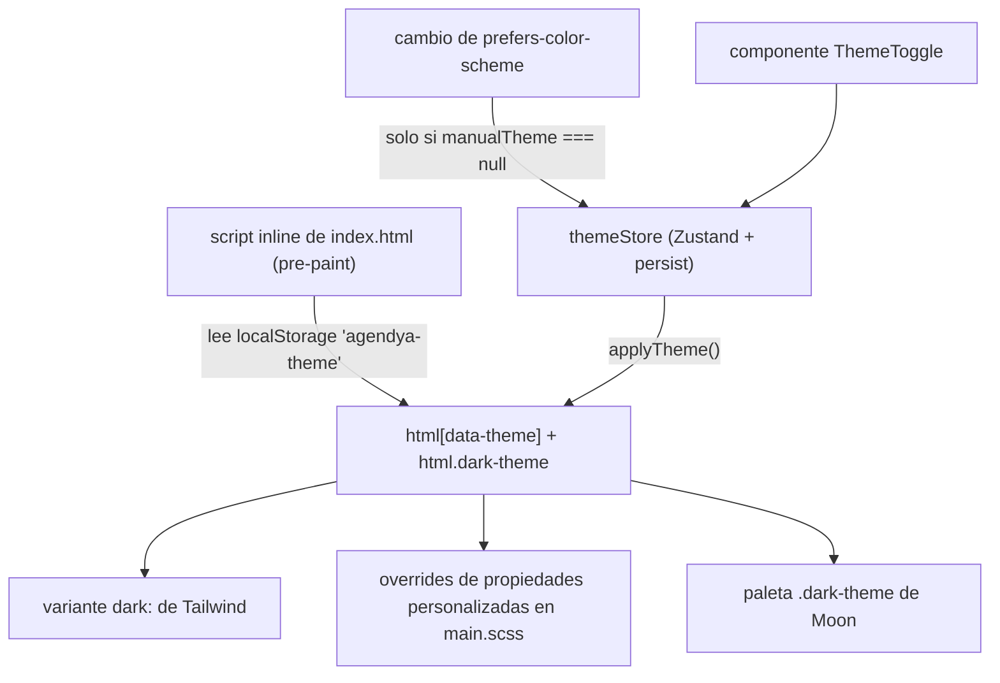

## Librerías

| Capa | Qué |
| --- | --- |
| **Moon Design System** | `@moondesignsystem/react` (componentes: `Button`, `Input`, `FormGroup`, `Checkbox`, `Select`, …) + `@moondesignsystem/ui` (CSS: `moon-core.css`, `moon-components.css`) |
| **Tailwind CSS v4** | vía `@tailwindcss/vite`; utilidades + un pequeño bloque `@theme` |
| **SCSS** | `src/main.scss` — propiedades CSS personalizadas (tokens de color, paleta de las insignias de estado) que cambian por tema |
| **Fuentes** | Outfit (display), Plus Jakarta Sans (cuerpo), Inter (mono) — cargadas vía `<link>` en `index.html` |

`src/styles/tailwind.css` es la única hoja de estilos que importa Tailwind **y**
el CSS de Moon juntos (Tailwind solo compila `@theme` donde también ve su propio
`@import 'tailwindcss'`).

```css
@import 'tailwindcss';
@import '@moondesignsystem/ui/dist/styles/moon-core.css';
@import '@moondesignsystem/ui/dist/styles/moon-components.css';

@theme inline {
  --font-display: 'Outfit', sans-serif;
  --font-body: 'Plus Jakarta Sans', sans-serif;
  --font-mono: 'Inter', monospace;
}

@custom-variant dark (&:where([data-theme="dark"], [data-theme="dark"] *));
```

## Tematización



Tres consumidores se mantienen en sincronía a partir de un solo atributo:

1. **Tailwind** `dark:` — atado a `[data-theme="dark"]`, **no** a
   `prefers-color-scheme`, así que sigue el toggle in-app.
2. **`main.scss`** — redefine propiedades personalizadas de color bajo el
   selector dark.
3. **Moon** — necesita su propia clase `.dark-theme` en `<html>`, que
   `applyTheme` también alterna.

Tema efectivo = `manualTheme ?? preferencia del SO`. Solo el override manual se
persiste (`partialize`), así que un cambio posterior del SO se recoge en la
siguiente visita si el usuario nunca usó el toggle.

## Átomos compartidos — `src/shared/components/`

| Componente | Propósito |
| --- | --- |
| `Button` | Envoltorio de botón con estilo de la app |
| `Input` | Etiqueta + input + ranura de error |
| `Card` | Contenedor de superficie |
| `Badge` | Pequeña píldora de estado/etiqueta (las insignias de estado usan `bookings/statusBadge.tsx` + `statusConfig.ts`) |

Los componentes locales a la funcionalidad viven bajo
`modules/<funcionalidad>/components/` (p. ej. `services/components/Toggle.tsx`,
`PlanLimitDialog.tsx`, `ServiceRowMenu.tsx`; `publicBooking/components/Calendar.tsx`,
`SlotGrid.tsx`, `BookingConfirmedView.tsx`).

## Accesibilidad

- `shared/a11y/useFocusTrap.ts` atrapa el foco dentro de modales/paneles
  (`RescheduleModal`, `AppointmentDrawer`, `BlockFormDrawer`).
- `DashboardLayout` renderiza un enlace de salto (`#main-content`), y `<main>`
  tiene `tabIndex={-1}` para que el enlace de salto pueda enfocarlo.
- La nav móvil es un `<nav aria-label="Principal">` etiquetado.
- La suite de Playwright ejecuta auditorías de `@axe-core/playwright`
  (`tests/e2e/a11y/audit.spec.ts`).

## Activos de marca

- Marca del logo: `src/imports/LogoGroup/` y `src/imports/Group11/` (componentes
  SVG de React exportados de Figma) — tres trazos índigo/violeta.
- Favicons: `apps/web/public/favicon.svg` (+ tamaños PNG, apple-touch-icon).
- Color de marca por defecto `#4F46E5` (indigo-600), también el `brandColor`
  editable de cada profesional.
