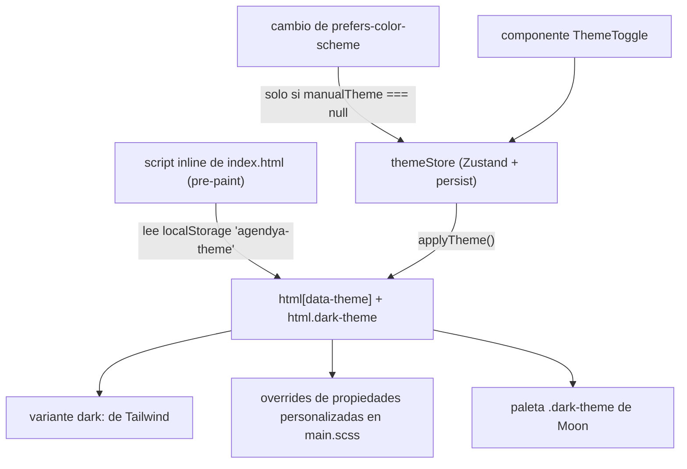

## Librerías

| Capa | Qué |
| --- | --- |
| **Moon Design System** | `@moondesignsystem/react` (componentes: `Button`, `Input`, `FormGroup`, `Checkbox`, `Select`, …) + `@moondesignsystem/ui` (CSS: `moon-core.css`, `moon-components.css`) |
| **Tailwind CSS v4** | vía `@tailwindcss/vite`; utilidades + un pequeño bloque `@theme` |
| **SCSS** | `src/main.scss` — propiedades CSS personalizadas (tokens de color, paleta de las insignias de estado) que cambian por tema |
| **Fuentes** | Outfit (display), Plus Jakarta Sans (cuerpo), Inter (mono) — cargadas vía `<link>` en `index.html` |

`src/styles/tailwind.css` es la única hoja de estilos que importa Tailwind **y**
el CSS de Moon juntos (Tailwind solo compila `@theme` donde también ve su propio
`@import 'tailwindcss'`).

```css
@import 'tailwindcss';
@import '@moondesignsystem/ui/dist/styles/moon-core.css';
@import '@moondesignsystem/ui/dist/styles/moon-components.css';

@theme inline {
  --font-display: 'Outfit', sans-serif;
  --font-body: 'Plus Jakarta Sans', sans-serif;
  --font-mono: 'Inter', ui-sans-serif, system-ui, sans-serif; /* Inter es proporcional; el nombre es histórico */
}

@custom-variant dark (&:where([data-theme="dark"], [data-theme="dark"] *));
```

## Tematización


```mermaid
flowchart TB
  IH["script inline de index.html (pre-paint)"] -->|"lee localStorage 'agendya-theme'"| SET["html[data-theme] + html.dark-theme"]
  TS["themeStore (Zustand + persist)"] -->|"applyTheme()"| SET
  OS["cambio de prefers-color-scheme"] -->|"solo si manualTheme === null"| TS
  TT["componente ThemeToggle"] --> TS
  SET --> TW["variante dark: de Tailwind"]
  SET --> SCSS["overrides de propiedades personalizadas en main.scss"]
  SET --> MOON["paleta .dark-theme de Moon"]
```

Tres consumidores se mantienen en sincronía a partir de un solo atributo:

1. **Tailwind** `dark:` — atado a `[data-theme="dark"]`, **no** a
   `prefers-color-scheme`, así que sigue el toggle in-app.
2. **`main.scss`** — redefine propiedades personalizadas de color bajo el
   selector dark.
3. **Moon** — necesita su propia clase `.dark-theme` en `<html>`, que
   `applyTheme` también alterna.

Tema efectivo = `manualTheme ?? preferencia del SO`. Solo el override manual se
persiste (`partialize`), así que un cambio posterior del SO se recoge en la
siguiente visita si el usuario nunca usó el toggle.

## Tokens semánticos

Todo color, overlay y elevación sale de una propiedad CSS personalizada definida
en `src/main.scss` (`:root` para claro, `html[data-theme='dark']` para oscuro).
El Backoffice (`apps/backoffice-web/src/styles/tailwind.css`) duplica los mismos
nombres y valores en un bloque `@theme` de Tailwind — mantén ambos archivos
sincronizados.

| Familia | Tokens | Notas |
| --- | --- | --- |
| Superficies | `--color-surface`, `--color-surface-soft` | `surface-soft` es el fondo de página, `surface` tarjetas/paneles/diálogos |
| Texto | `--color-text-primary`, `-secondary`, `-muted`, `--color-text-brand`, `--color-text-on-brand` | Todos AA (≥4.5:1) sobre ambas superficies en ambos temas. Usa `text-brand` (no `brand-primary`) para texto pequeño de color de marca |
| Marca | `--color-brand-primary`, `-hover`, `--color-brand-tint`, `--color-brand-surface`, `--color-brand-border` | Las superficies de marca hacen también de familia "info" |
| Bordes | `--color-border` (decorativo), `--color-border-strong` (controles de formulario) | `border-strong` cumple el 3:1 de WCAG 1.4.11 para el contorno de un control |
| Peligro | `--color-danger`, `-surface`, `-border`, `-fill` | `-fill` = fondo sólido de botón bajo texto blanco |
| Éxito | `--color-success`, `-surface`, `-border` | |
| Advertencia | `--color-warning`, `-surface`, `-border`, `-fill` | |
| Estado de cita | `--status-{pending,confirmed,cancelled,completed,noshow,expired}-{color,bg,border}` | Ver `bookings/statusConfig.ts` |
| Elevación | `--shadow-menu`, `--shadow-dialog`, `--shadow-drawer`, `--shadow-focus-brand`, `--overlay-scrim` | El tema oscuro cambia las sombras pizarra por sombras negras |
| Radio | `--radius-control` (8px) | Las tarjetas usan 16–24px (`rounded-2xl`/`rounded-3xl`) |

Los hex fijos quedan reservados para: el `brandColor` por defecto de cada
profesional (`#4F46E5`), marcas de terceros (logo de Google), las estrellas
decorativas de valoración y el placeholder de la imagen de las pantallas de
autenticación.

El `--font-default` propio de Moon apunta a la fuente de cuerpo en `main.scss`,
así que los componentes de Moon y sus utilidades `text-*` (incluidas variantes
responsive como `lg:text-sm`) nunca caen a la "DM Sans" que no se carga.

## Átomos compartidos — `src/shared/components/`

| Componente | Propósito |
| --- | --- |
| `Button` | Envoltorio de botón con estilo de la app |
| `Input` | Etiqueta + input + ranura de error |
| `Card` | Contenedor de superficie |
| `Badge` | Pequeña píldora de estado/etiqueta (las insignias de estado usan `bookings/statusBadge.tsx` + `statusConfig.ts`) |
| `ConfirmDialog` / `useConfirmDialog` | El diálogo de confirmación de la app (trampa de foco, Escape, variante destructiva). `await confirm({...})` reemplaza a `window.confirm()` |

`Button`, `Input`, `Card` y `Badge` usan los mismos tokens y nombres de variante
que los componentes homónimos del Backoffice.

Los componentes locales a la funcionalidad viven bajo
`modules/<funcionalidad>/components/` (p. ej. `services/components/Toggle.tsx`,
`PlanLimitDialog.tsx`, `ServiceRowMenu.tsx`; `publicBooking/components/Calendar.tsx`,
`SlotGrid.tsx`, `BookingConfirmedView.tsx`).

## Accesibilidad

- `shared/a11y/useFocusTrap.ts` atrapa el foco dentro de modales/paneles
  (`RescheduleModal`, `AppointmentDrawer`, `BlockFormDrawer`).
- `DashboardLayout` renderiza un enlace de salto (`#main-content`), y `<main>`
  tiene `tabIndex={-1}` para que el enlace de salto pueda enfocarlo.
- La nav móvil es un `<nav aria-label="Principal">` etiquetado. Por debajo de
  `lg`, el avatar de la barra superior abre un menú de cuenta
  (`dashboard/MobileAccountMenu.tsx`) — la única vía para cerrar sesión en
  teléfonos y tablets.
- Los campos de texto hechos a mano reciben un anillo `:focus-visible` de marca
  de 2px global desde `main.scss` (anula su `outline: none` inline); los
  controles de Moon dibujan su propio anillo.
- Una regla global de `prefers-reduced-motion` acorta toda transición/animación.
- Las secciones del panel de administrador usan el patrón de pestañas WAI-ARIA
  (flechas, Inicio/Fin).
- La suite de Playwright ejecuta auditorías de `@axe-core/playwright`
  (`tests/e2e/a11y/audit.spec.ts`).

## Activos de marca

- Marca del logo: `src/imports/LogoGroup/` y `src/imports/Group11/` (componentes
  SVG de React exportados de Figma) — tres trazos índigo/violeta.
- Favicons: `apps/web/public/favicon.svg` (+ tamaños PNG, apple-touch-icon).
- Color de marca por defecto `#4F46E5` (indigo-600), también el `brandColor`
  editable de cada profesional.
