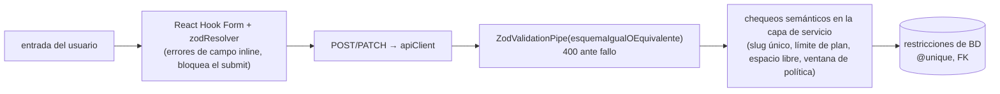

Cada formulario usa **React Hook Form** con un resolver de **Zod**
(`@hookform/resolvers/zod`). Los `Input` / `FormGroup` / `Checkbox` / `Select`
de Moon se conectan mediante el `<Controller>` de RHF.

```tsx
const { control, handleSubmit, formState: { errors } } =
  useForm<LoginInput>({ resolver: zodResolver(loginSchema) });

const onSubmit = handleSubmit((data) => loginMutation.mutate(data, {
  onSuccess: () => navigate('/dashboard/profile', { replace: true }),
}));
```

## Dos fuentes de esquema

| Formulario | Esquema | Fuente |
| --- | --- | --- |
| Login | `loginSchema` | `@agendya/types` — **el mismo objeto que valida la API** |
| Registro | `registerSchema` | `@agendya/types` |
| Perfil | `updateProfileSchema` (+ `slugSchema`, `hexColorSchema`) | `@agendya/types` |
| Formulario de servicio | `serviceFormSchema` local a la página en `ServiceFormPage.tsx` | **refleja** `createServiceSchema` con mensajes localizados y valores por defecto no nullables |
| Horario de atención | `setWorkingHoursSchema` | `@agendya/types` (`superRefine`: ≤ 6 bloques/día, sin solape) |
| Asistente de reserva | Campos de `createBookingSchema`, paso a paso | `@agendya/types` |

:::note[Por qué algunos formularios reflejan en lugar de reutilizar]
`createServiceSchema` usa `.superRefine` y opcionales nullables que no mapean
limpiamente a inputs controlados con valores por defecto definidos, y sus
mensajes son genéricos. `ServiceFormPage` mantiene un esquema local con las
mismas reglas, mensajes en español y adaptadores `toFormValues` / `toPayload`.
Cuando la regla compartida cambia, **ambos** deben cambiar — esto se señala en
la [Guía de desarrollo](/development-guide/).
:::

## Capas de validación



La validación del cliente es por UX; la API nunca confía en ella. Las reglas
semánticas que necesitan la base de datos (unicidad, disponibilidad, propiedad,
límites de plan) solo existen en el servidor y afloran como `409` / `403` /
`404`, que los formularios muestran vía `getApiErrorMessage`.

## Visualización de errores

- **Errores de campo:** `formState.errors.<campo>.message` bajo cada input.
- **Errores a nivel de formulario** (el servidor rechaza): un banner renderizado
  desde `getApiErrorMessage(mutation.error, '…')`.
- **Manejo de conflictos:** el asistente de reserva inspecciona
  `ApiError.status === 409` para devolver al usuario a la selección de espacio
  con un mensaje de «esa hora acaba de ser tomada».

## Reglas de campo comunes (de `@agendya/types`)

| Campo | Regla |
| --- | --- |
| `email` | recortado, en minúsculas, email RFC |
| `password` (registro) | 8–72 caracteres |
| `businessName` | 2–100 |
| `slug` | minúsculas, 3–50, `^[a-z0-9]+(-[a-z0-9]+)*$` |
| `brandColor` | `^#[0-9a-fA-F]{6}$` |
| `customerPhone` | `^[0-9+\-\s()]{7,20}$` |
| `durationMinutes` | entero 5–480 |
| `priceCents` | entero 0–100 000 000 |
| parámetros `date` | `^\d{4}-\d{2}-\d{2}$` |
| URLs de imagen de perfil | deben empezar por `http://` / `https://` (bloquea `javascript:` / `data:`) |
