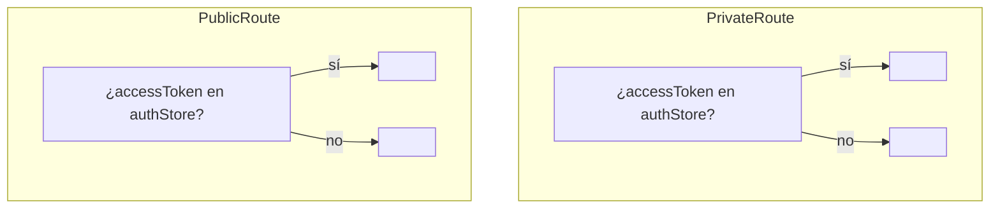

Definido íntegramente en `src/routes/AppRouter.tsx` con `<BrowserRouter>` y un
único bloque `<Routes>` envuelto en un solo
`<Suspense fallback={<RouteFallback/>}>`.

## Tabla de rutas

| Ruta | Componente | Guard | Bundle |
| --- | --- | --- | --- |
| `/login` | `LoginPage` | `<PublicRoute>` | **inicial** |
| `/register` | `RegisterPage` | `<PublicRoute>` | lazy |
| `/forgot-password` | `ForgotPasswordPage` | `<PublicRoute>` | lazy · *(aún sin API detrás)* |
| `/auth/callback` | `GoogleCallbackPage` | ninguno | lazy |
| `/dashboard/profile` | `ProfilePage` | `<PrivateRoute>` → `<DashboardLayout>` | lazy |
| `/dashboard/services` | `ServicesPage` | `<PrivateRoute>` → `<DashboardLayout>` | lazy |
| `/dashboard/services/new` | `ServiceFormPage` | ″ | lazy |
| `/dashboard/services/:id/edit` | `ServiceFormPage` | ″ | lazy |
| `/dashboard/schedule` | `SchedulePage` | ″ | lazy |
| `/dashboard/schedule/:day` | `DaySchedulePage` | ″ | lazy |
| `/dashboard/agenda` | `AgendaPage` | ″ | lazy |
| `/bookings/:token` | `BookingCancelPage` | ninguno (acotado por token) | lazy |
| `/:slug` | `PublicBookingPage` | ninguno | lazy |
| `/` | → `Navigate to="/login"` | — | — |
| `*` | → `Navigate to="/login"` | — | — |

## Guards

Ambos leen `useAuthStore((s) => s.accessToken)`. **No hay comprobación de rol a
nivel de ruta** — solo hay un rol. `GoogleCallbackPage` queda deliberadamente
fuera de ambos guards porque corre durante la transición de sin autenticar a
autenticado.

## Parámetros de ruta

| Parámetro | Ruta | Se usa para |
| --- | --- | --- |
| `:slug` | `/:slug` | `usePublicProfessional(slug)` → página pública + asistente |
| `:token` | `/bookings/:token` | `useBookingByToken(token)` → ver / cancelar / reprogramar |
| `:id` | `/dashboard/services/:id/edit` | Modo edición de `ServiceFormPage` (`useServices` + find) |
| `:day` | `/dashboard/schedule/:day` | `slugToWeekday(day)` (`lunes`…`domingo`) |

`/:slug` se declara **la última** para que las rutas literales (`/login`,
`/dashboard/*`, `/bookings/*`, `/auth/*`) siempre ganen.

## División de código

Solo `LoginPage` va en el chunk de entrada — es la ruta de aterrizaje
garantizada (`/` y `*` redirigen ahí). Todo lo demás es
`lazy(() => import(...))`. `vite.config.ts` además fija el runtime de React
(`react`, `react-dom`, `react-router*`, `scheduler`) en un chunk estable
`react-vendor` para que los deploys de la app no lo invaliden en la caché. Ver
[Rendimiento](/performance/).

## Cascarón de layout

`DashboardLayout` renderiza la `Sidebar` de escritorio + una barra superior y
una nav inferior móviles (`NAV_ITEMS` en `dashboard/navItems.ts`: Agenda,
Servicios, Horario, Perfil), un enlace de salto `<a href="#main-content">`, el
`ThemeToggle` y un `<Outlet/>` para la página de panel activa.
