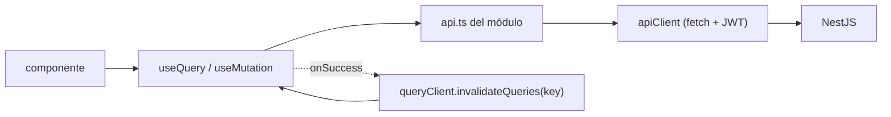

## El reparto

| Tipo de estado | Dueño | Ejemplos |
| --- | --- | --- |
| **Estado del servidor** (todo aquello de lo que la API es la fuente de la verdad) | **TanStack Query** | perfil, servicios, horario, excepciones, agenda, disponibilidad, profesional público, reserva-por-token |
| **Estado del cliente** (sobrevive a la navegación, a veces a recargas) | **Zustand** (`persist`) | sesión de auth, override de tema, datos de contacto de la reserva pública |
| **Estado de UI efímero** | `useState` / React Hook Form | diálogo abierto, paso actual del asistente, campos de formulario |

## apiClient

`src/shared/api/apiClient.ts` — un envoltorio fino sobre `fetch`, **no** axios
(axios aparece en docs antiguos, pero el código usa `fetch`).

```ts
apiClient.get<T>(path, { params, headers, signal })
apiClient.post<T>(path, body, opts)   // body: objeto → JSON; FormData → multipart
apiClient.put<T> / patch<T> / delete<T>
// → Promise<{ data: T }>
```

- URL base: `import.meta.env.VITE_API_URL || http://${location.hostname}:4000`.
- Inyecta `Authorization: Bearer <token>` desde `useAuthStore.getState()` cuando
  existe un token.
- No-2xx → lanza `ApiError(status, cuerpoParseado)`. Un `401` además llama a
  `useAuthStore.getState().logout()`.
- `isApiError(e)` hace de type-guard; el asistente de reserva se ramifica según
  `e.status === 409`.

## Patrón de hook de query

Cada módulo tiene `hooks/` con un hook por operación:

```ts
// lectura
export const SERVICES_QUERY_KEY = ['services'] as const;
export function useServices() {
  return useQuery({ queryKey: SERVICES_QUERY_KEY, queryFn: listServices });
}

// escritura
export function useCreateService() {
  const qc = useQueryClient();
  return useMutation({
    mutationFn: createService,
    onSuccess: () => qc.invalidateQueries({ queryKey: SERVICES_QUERY_KEY }),
  });
}
```

Claves de query en uso: `['services']`, `['profile']`, `['working-hours']`,
`['exceptions']`, `['agenda', from, to]`, `['availability', slug, serviceIds,
date, atHome]`, `['public-professional', slug]`, `['booking', token]`.

El `QueryClient` se crea una sola vez en `main.tsx` con opciones por defecto
(sin override global de `staleTime`).



## Stores de Zustand

### `authStore` (`modules/auth/authStore.ts`)

```ts
{ accessToken: string | null, user: AuthUser | null,
  setSession({ accessToken, user }), logout() }
```

`persist` → `localStorage['agendya-auth']`. Lo leen de forma **síncrona**
`apiClient` y ambos guards de ruta, así que una recarga te mantiene con la
sesión iniciada sin parpadeo.

### `themeStore` (`shared/theme/themeStore.ts`)

```ts
{ theme: 'light' | 'dark',              // derivado, aplicado a <html data-theme>
  manualTheme: 'light' | 'dark' | null, // persistido (partialize)
  setTheme(t), toggleTheme(), useSystemTheme() }
```

El tema efectivo siempre es `manualTheme ?? preferencia del SO`. `index.html`
corre un script inline pre-paint para evitar un parpadeo; el store mantiene DOM
+ estado en sincronía después y escucha los cambios de `prefers-color-scheme`
mientras no haya override manual. También refleja `.dark-theme` en `<html>` para
los componentes de Moon.

### `customerStore` (`modules/publicBooking/customerStore.ts`)

Guarda el nombre/email/teléfono del cliente para que el paso de contacto del
asistente venga prellenado en reservas repetidas. No persistido.
