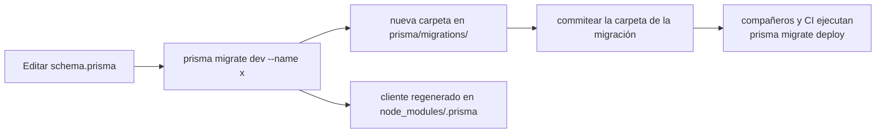

## PostgreSQL local

```bash
docker compose -f infra/docker-compose.yml up -d      # arrancar
docker compose -f infra/docker-compose.yml logs -f    # seguir los logs
docker compose -f infra/docker-compose.yml down       # detener (conserva el volumen)
docker compose -f infra/docker-compose.yml down -v    # detener + borrar los datos
```

| Ajuste | Valor |
| --- | --- |
| Imagen | `postgres:16-alpine` |
| Contenedor | `agendya-postgres` |
| Usuario / contraseña | `agendya` / `agendya_dev_password` |
| Base de datos | `agendya_dev` |
| Puerto host | `5433` → contenedor `5432` |
| Volumen | `agendya_postgres_data` (con nombre, persiste entre reinicios) |

El `DATABASE_URL` correspondiente ya está en `apps/api/.env.example`.

## Configuración de Prisma

- **Esquema:** `apps/api/prisma/schema.prisma`
- **Generador de cliente:** `prisma-client-js`
- **Datasource:** `postgresql`, URL desde `DATABASE_URL`
- **Driver adapter:** `@prisma/adapter-pg` (`PrismaPg`) — ver
  `apps/api/src/database/prisma.service.ts`. `PrismaService` extiende
  `PrismaClient`, conecta en `onModuleInit`, desconecta en `onModuleDestroy` y
  se exporta desde un `DatabaseModule` `@Global()`.

```ts
// apps/api/src/database/prisma.service.ts
constructor() {
  super({ adapter: new PrismaPg({ connectionString: process.env.DATABASE_URL }) });
}
```

## Migraciones

La Fase 1 incluye 12 migraciones, desde `20260724171135_init` hasta
`20260907120000_optimize_booking_indexes`.

| Comando | Cuándo |
| --- | --- |
| `npx prisma migrate deploy` | Primera puesta en marcha, y tras cada `git pull` que agregue migraciones. Aplica solo las migraciones pendientes; **no** detecta drift ni regenera el cliente. Se usa en CI. |
| `npx prisma migrate dev --name <descripción>` | Cambiaste `schema.prisma` y quieres una nueva migración. Crea el SQL, lo aplica y regenera el cliente. Solo para desarrollo. |
| `npx prisma migrate reset` | Borrar y reaplicar todo desde cero (elimina todos los datos). |
| `npx prisma generate` | Regenerar el cliente tipado sin tocar la base de datos. |
| `npx prisma studio` | Explorador GUI en `http://localhost:5555`. |

Ejecuta todos estos desde `apps/api/`.



## Sembrado (seeding)

No hay un hook `prisma db seed` cableado. Un script independiente,
`apps/api/prisma/seed-services.mjs`, inserta un lote de servicios de ejemplo
para un profesional existente:

```bash
node apps/api/prisma/seed-services.mjs
```

Lee el script antes de ejecutarlo — apunta a una cuenta concreta.

:::note[Peculiaridad de la cabecera del esquema]
La línea 2 de `schema.prisma` referencia una ruta de archivo de plan en la
máquina del autor original (`/Users/.../dreamy-mixing-lark.md`). Es un
comentario obsoleto; ignóralo.
:::

Para la referencia completa del modelo ver [Base de datos](/database/er-model/).
