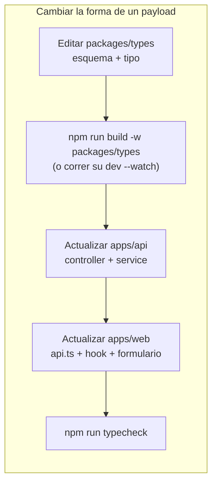
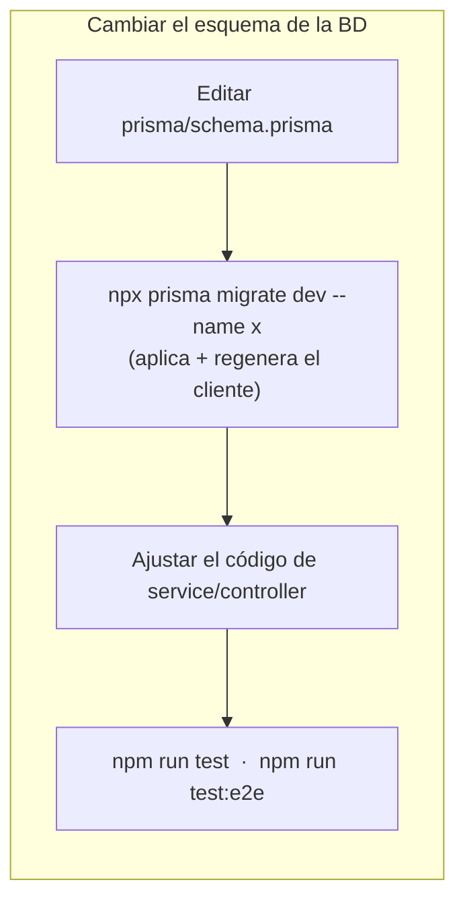

## Scripts de la raíz (`package.json`)

| Comando | Qué hace |
| --- | --- |
| `npm run dev:api` | `start:dev` en `apps/api` — NestJS en modo watch en `:4000` |
| `npm run dev:web` | `vite` en `apps/web` en `:5173` |
| `npm run dev:web:host` | Vite expuesto en la LAN (`--host`) para probar desde un móvil / otro dispositivo |
| `npm run build` | `build` en cada workspace |
| `npm run lint` | `lint` en cada workspace (ESLint para `apps/api`, oxlint para `apps/web`) |
| `npm run test` | `test` en cada workspace (Jest unitario / Vitest) |
| `npm run typecheck` | `typecheck` en cada workspace |
| `npm run format` / `format:check` | Prettier sobre el repo (excluye `apps/api` y todos los `*.md`) |

## Solo API (`cd apps/api`)

| Comando | Qué hace |
| --- | --- |
| `npm run start:dev` | Servidor en modo watch |
| `npm run test` | Specs unitarios de Jest (`src/**/*.spec.ts`) |
| `npm run test:e2e` | Specs e2e de Jest (`test/**/*.e2e-spec.ts`, `--runInBand`) — necesita Postgres |
| `npm run lint` | ESLint `--fix` |
| `npx prisma migrate dev --name <desc>` | Crear + aplicar una nueva migración |
| `npx prisma studio` | Explorar la base de datos en una GUI |
| `npx prisma generate` | Regenerar el cliente tras editar el esquema |

## Solo web (`cd apps/web`)

| Comando | Qué hace |
| --- | --- |
| `npm run dev` | Servidor de desarrollo de Vite |
| `npm run build` | `tsc -b && vite build` |
| `npm run test` | Vitest (modo run) |
| `npm run typecheck` | `tsc -b --noEmit` + `tsc -p tsconfig.e2e.json` |
| `npm run lint` | oxlint |
| `npm run test:e2e` | Playwright (arranca/reutiliza el dev server de Vite, stubea la API) |
| `npm run test:e2e:ui` / `:headed` / `:report` | Playwright UI / con navegador visible / abrir el último reporte |
| `npm run test:e2e:install` | Una vez: descargar la build de Chromium |

## Ciclos típicos





:::tip[Vigila el paquete compartido]
Ejecuta `npm run dev --workspace packages/types` (`tsc --watch`) en otra
terminal mientras tocas `@agendya/types` para que ambas apps recojan los cambios
sin un rebuild manual.
:::

## Editar esta documentación

```bash
cd docs
npm install        # solo la primera vez
npm run dev        # dev server de Starlight en http://localhost:4321
npm run build      # build de producción a docs/dist/
```

Las páginas son Markdown/MDX bajo `docs/src/content/docs/`. La barra lateral se
define en `docs/astro.config.mjs`. Ver la [Guía de desarrollo](/development-guide/)
para la lista de pasos de «agregar una página de docs».
