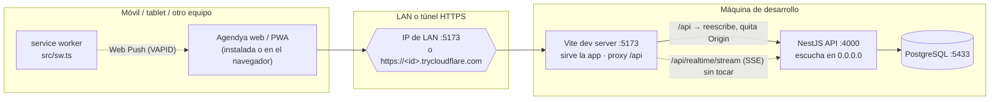
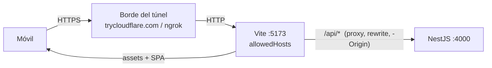
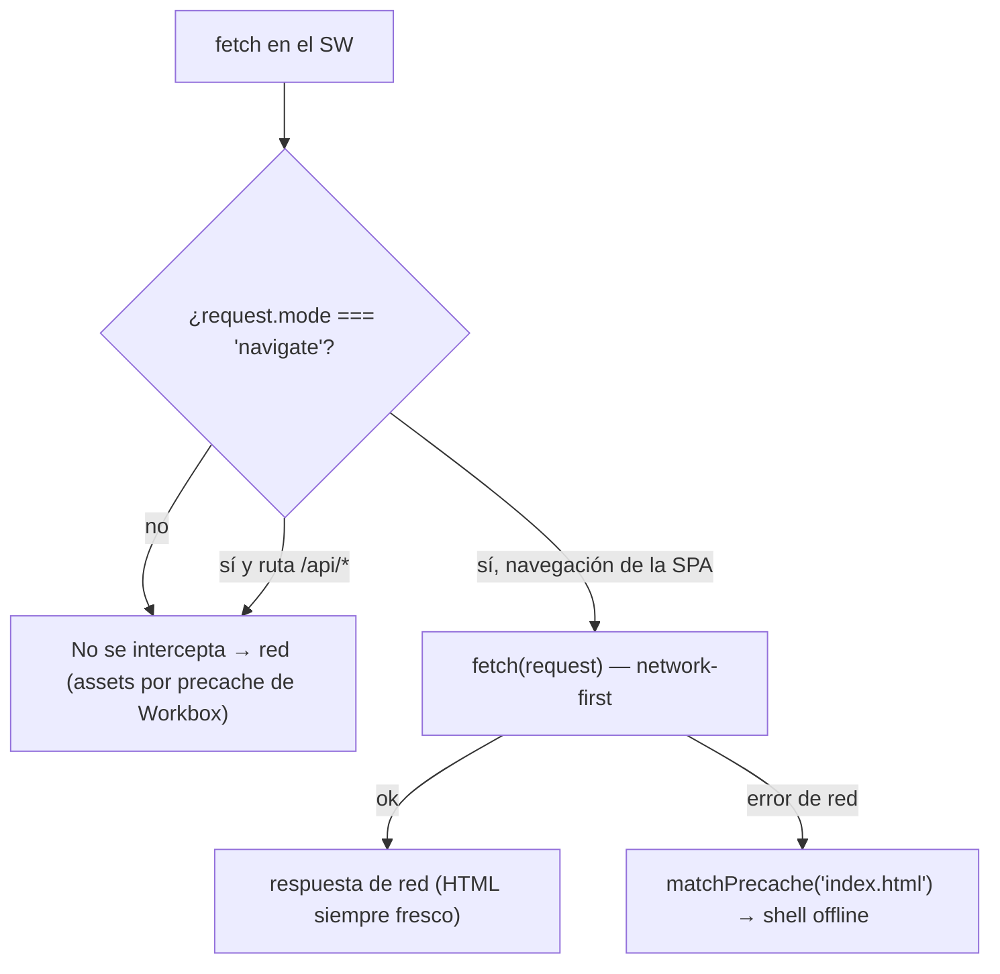
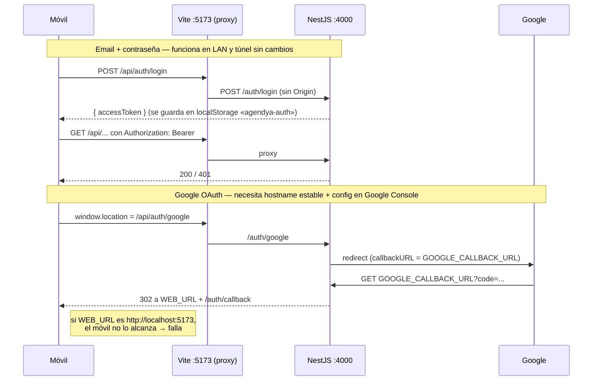
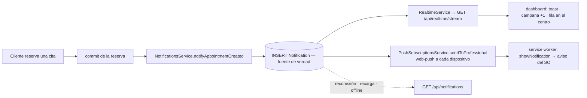
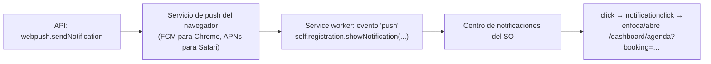

La web de Agendya es una **PWA instalable**: shell offline + Web Push del sistema
operativo al profesional. El aviso de permiso de notificaciones y «Añadir a
pantalla de inicio» solo funcionan sobre `localhost` o **HTTPS**, así que probar
en un móvil real implica llegar a la máquina de desarrollo por la **LAN** o por
un **túnel HTTPS**. Nada de esto hace falta para el desarrollo normal en
`localhost`.

## Arquitectura

Puntos clave:

- **La URL de la API nunca está hardcodeada.**
  `apps/web/src/shared/api/apiClient.ts` la resuelve en tiempo de ejecución:
  `VITE_API_URL` si está definida → si no, `http://localhost:4000` en localhost →
  si no, **`/api` en el mismo origen**, que el dev server de Vite redirige a
  `:4000` (`apps/web/vite.config.ts` → `server.proxy`). Una IP de LAN o un
  hostname de túnel que cambia en cada arranque simplemente funcionan, y una
  página HTTPS llega a la API por HTTPS sin bloqueo de contenido mixto.
- La API escucha en `0.0.0.0` (`apps/api/src/main.ts`), así que el proxy la
  alcanza por cualquier interfaz.
- La autenticación es un **JWT en la cabecera `Authorization`** (sin cookies): no
  hay superficie de `SameSite`/`Secure`/CSRF para el uso entre dispositivos. El
  stream SSE usa la misma cabecera vía `fetch` (no `EventSource`).
- El proxy de Vite **elimina la cabecera `Origin`** en el salto a Nest: ese salto
  es servidor-a-servidor y la lista de CORS de la API rechaza orígenes que no
  sean localhost/red privada. El navegador nunca ve un chequeo de CORS porque
  página y petición comparten origen.

## Arquitectura del túnel

No hay ningún proceso de túnel propio ni script que lo arranque: se ejecuta
**cloudflared** o **ngrok** a mano en una tercera terminal, apuntando al puerto
de Vite.

- **Un solo túnel**, hacia el puerto **5173**. Los assets y `/api` (REST + SSE)
  van todos por él. No se tuneliza `:4000` por separado.
- **HTTPS**: lo termina el borde del túnel. La app hereda el esquema `https` de
  la página, así que `apiBaseUrl` queda `https://<túnel>/api` y no hay contenido
  mixto.
- **Hosts permitidos**: solo `*.trycloudflare.com`, `*.ngrok-free.app` y
  `*.ngrok.io` están en `server.allowedHosts` de `vite.config.ts`. Para otro
  proveedor, añade el dominio ahí (si no, Vite responde
  `Blocked request. This host is not allowed`).
- **CORS**: `isAllowedOrigin` (`apps/api/src/common/utils/cors.util.ts`) permite
  `WEB_URL` exacto y cualquier origen http(s) en `localhost` / `127.0.0.1` /
  `10.x` / `192.168.x` / `172.16–31.x`. Las peticiones por túnel llegan en el
  mismo origen sin `Origin`, así que ni pasan por CORS.
- El hostname del túnel **cambia en cada arranque** y no se guarda en ningún
  sitio. Lo único que necesita un hostname estable es Google OAuth (ver abajo).

## Configuración de entorno

`cp apps/api/.env.example apps/api/.env` y `cp apps/web/.env.example apps/web/.env`.
Ver también [Variables de entorno](/getting-started/environment/).

| Archivo | Variable | Papel para PWA / red |
| --- | --- | --- |
| `apps/api/.env` | `WEB_URL` | Origen permitido de CORS **y** base a la que redirige el callback de Google OAuth. `http://localhost:5173` por defecto; solo se cambia para OAuth tunelizado. |
| `apps/api/.env` | `GOOGLE_CLIENT_ID` / `_SECRET` / `GOOGLE_CALLBACK_URL` | Inicio de sesión con Google. `GOOGLE_CALLBACK_URL` por defecto `http://localhost:4000/auth/google/callback`. |
| `apps/api/.env` | `VAPID_PUBLIC_KEY` / `VAPID_PRIVATE_KEY` / `VAPID_SUBJECT` | Web Push. Genera el par con `npx web-push generate-vapid-keys`. Las tres deben estar puestas; con cualquiera vacía, push desactivado y el feed sigue por SSE. |
| `apps/api/.env` | `REALTIME_HEARTBEAT_MS` | Opcional. Intervalo del keep-alive SSE (por defecto `25000`). |
| `apps/web/.env` | `VITE_API_URL` | **Dejar sin definir** para dev en LAN/túnel (autodetección + proxy `/api`). Definirla solo para fijar un backend concreto o en un **build de producción**, donde no hay proxy de Vite. Las vars de cliente llevan prefijo `VITE_`. |

## Comandos de desarrollo

| Objetivo | Comandos |
| --- | --- |
| Dev normal (localhost) | `npm run dev:api` · `npm run dev:web` |
| PWA por LAN | `npm run dev:api` · `npm run dev:web:host` (Vite imprime la línea `Network:`) |
| PWA por túnel HTTPS | lo anterior + en otra terminal: `cloudflared tunnel --url http://localhost:5173` **o** `ngrok http 5173` |
| Verificar la PWA de producción | `npm run verify:pwa` — build + `vite preview` + checks headless sobre manifest, service worker, precache y navegación offline |
| E2E de la PWA (dev) | `npm run test:e2e --workspace apps/web` (incluye `tests/e2e/pwa/pwa.spec.ts`) |

El service worker se registra también en dev (`devOptions.enabled` en
`vite.config.ts`), así que manifest, icono de instalación y DevTools ▸
Application funcionan sin un build de producción. Safari/iOS sigue necesitando
HTTPS real (túnel) para «Añadir a pantalla de inicio».

### Acceso desde otro dispositivo, paso a paso

1. Arranca Postgres: `docker compose -f infra/docker-compose.yml up -d`.
2. Arranca la API: `npm run dev:api`.
3. Arranca la web expuesta: `npm run dev:web:host`.
4. (Túnel) Arranca `cloudflared` / `ngrok` apuntando a `5173`.
5. Copia la URL generada (línea `Network:` de Vite, o la URL HTTPS del túnel).
6. Ábrela en el móvil (misma Wi-Fi para LAN).
7. Instala: Android Chrome ▸ ⋮ ▸ *Instalar app*; iOS Safari ▸ Compartir ▸
   *Añadir a pantalla de inicio* (iOS 16.4+ y abrir desde el icono para Web Push).
8. En el centro de notificaciones, pulsa **Activar** en el banner de push.

## Arquitectura de la PWA

- **`vite-plugin-pwa`, estrategia `injectManifest`** (`vite.config.ts`): el
  service worker es código propio (`apps/web/src/sw.ts`); Workbox solo le inyecta
  el manifiesto de precache. No se usa `generateSW`.
- **Manifest** (generado desde `vite.config.ts` → `manifest`): `name` /
  `short_name` `Agendya`, `start_url` y `scope` `/`, `display` `standalone`,
  `theme_color` `#4F46E5` (en sincronía con `<meta name="theme-color">` de
  `index.html`), `background_color` `#FFFFFF`, iconos 192/512 `any` + 192/512
  `maskable` en `apps/web/public/`.
- **iOS**: `index.html` añade los `apple-mobile-web-app-*` que
  `vite-plugin-pwa` no pone. Web Push en iOS solo con la PWA **instalada**
  (iOS 16.4+) y pidiendo permiso desde un gesto del usuario.
- **Registro**: `vite-plugin-pwa` inyecta `registerSW.js`, que registra `/sw.js`
  con scope `/` en el evento `load`.

### Estrategia del service worker

- **Precache** (`precacheAndRoute(self.__WB_MANIFEST)` + `cleanupOutdatedCaches()`):
  solo el shell estático — `js/css/html/svg/png/ico/webmanifest` — versionado por
  build. ~1 MB, ~51 entradas.
- **Navegaciones**: manejador `fetch` propio **network-first** con fallback al
  `index.html` precacheado cuando no hay red. Así un refresco duro o un
  deep-link abren offline, pero online siempre se sirve el HTML más reciente
  (nunca un shell rancio). `/api/*` se excluye explícitamente.
- **Respuestas de API nunca se cachean.** El SW no tiene rutas de runtime para
  `/api` — REST, auth y SSE siempre van a la red. Sin datos privados ni sesiones
  obsoletos en caché.
- **Actualización**: `registerType: 'autoUpdate'` + `skipWaiting()` +
  `clients.claim()` — un nuevo deploy activa el SW nuevo en la siguiente carga
  completa. Aún no hay aviso «nueva versión disponible» en la app; para forzar:
  DevTools ▸ Application ▸ Service Workers ▸ *Unregister* y recargar.

## Flujo de autenticación en red / túnel

- **Email + contraseña**: funciona en todas partes. El JWT va en
  `Authorization`, se persiste en `localStorage` (`agendya-auth`), y un `401`
  hace `logout()` tanto en REST como en SSE.
- **Google OAuth**: el callback redirige a **`WEB_URL`** y Google solo redirige a
  la `GOOGLE_CALLBACK_URL` **exacta** registrada en la consola. Con los valores
  por defecto (ambos `localhost`) **el inicio con Google desde un móvil/túnel no
  funciona**. Para habilitarlo hace falta un túnel con **hostname estable**
  (cloudflared con túnel nombrado, o dominio reservado de ngrok) y:
  1. Google Cloud Console ▸ *APIs y servicios* ▸ *Credenciales* ▸ tu cliente
     OAuth 2.0:
     - *Orígenes de JavaScript autorizados*: `https://<túnel-estable>`
     - *URIs de redirección autorizados*:
       `https://<túnel-estable>/api/auth/google/callback`
       (el proxy de Vite quita `/api` antes de llegar a Nest en
       `/auth/google/callback`).
  2. `apps/api/.env`: `WEB_URL=https://<túnel-estable>` y
     `GOOGLE_CALLBACK_URL=https://<túnel-estable>/api/auth/google/callback`.
  3. Reiniciar la API. No tocar el cliente/redirects de OAuth de producción — usa
     uno de desarrollo aparte.
- Cierre de sesión (`Sidebar`): `disablePush()` quita la suscripción push de este
  navegador **antes** de borrar el token, para que dejen de llegar avisos de esa
  cuenta al dispositivo.

Ver también [Flujo de autenticación](/architecture/authentication/).

## Arquitectura de notificaciones en tiempo real

El detalle vive en [Notificaciones](/features/notifications/); resumen para el
caso PWA:

- La fila `Notification` es la **fuente de verdad**; SSE y Web Push son canales
  de entrega best-effort **encima** del `INSERT`.
- Un evento SSE perdido (profesional offline, pestaña cerrada, evento no
  recibido, varias pestañas) **se recupera** al abrir el dashboard: badge y feed
  se cargan desde `GET /notifications`.
- El cliente SSE es una única conexión con recuento de referencias, backoff
  exponencial con jitter, reconexión al volver la pestaña visible, y parada en
  `logout` / `401`. No duplica toasts ni filas al reconectar.

### Añadir Web Push nativo más adelante

Ya está implementado el canal de Web Push del profesional. Si en el futuro se
amplía (p. ej. push también al cliente, o nuevos tipos de evento), la
arquitectura **no hay que reescribirla**:

- `NotificationsService.create()` es el **único punto de escritura** del feed;
  cada canal cuelga de ahí tras el `INSERT`. Un canal nuevo es una llamada más,
  fire-and-forget, sin cambio de schema ni de API.
- El modelo `PushSubscription` ya es una fila por `(profesional, endpoint)` con
  `endpoint` único global; para push a clientes bastaría un modelo análogo
  atado a `Booking`/cliente.
- El service worker ya hace `push` + `notificationclick` con deep-link; nuevos
  tipos solo añaden campos al `pushMessageSchema` (`@agendya/types`) y una rama
  de navegación.
- Requisitos operativos para producción: servir la app por HTTPS, claves VAPID
  estables en el entorno del servidor, y un `VAPID_SUBJECT` de contacto válido.

### Aviso nativo del SO en escritorio (macOS / Windows / Linux)

El mismo canal de Web Push produce el aviso en el **Centro de notificaciones de
macOS** cuando la PWA está instalada en Chrome. Cadena completa y sus condiciones:

1. **Contexto seguro** — `http://localhost` y `127.0.0.1` **sí** cuentan como
   contexto seguro: Service Worker, Notification API y Push API funcionan sin
   HTTPS en `localhost`. El aviso de Chrome «Your connection to this site is not
   secure» es solo por la falta de certificado; **no** desactiva estas APIs en
   `localhost`. Un túnel HTTPS también sirve.
2. **Permiso del sitio** — `Notification.permission === 'granted'` (Chrome ▸
   candado ▸ Notificaciones: *Permitir*). Necesario pero **no suficiente**.
3. **Suscripción registrada** — la app tiene que haber llamado
   `pushManager.subscribe()` y haber hecho `POST /notifications/push/subscribe`.
   Eso ocurre al pulsar **Activar** en el centro de notificaciones. Es **por
   navegador y por dispositivo**: activarlo en el iPhone no lo activa en el Mac.
   Verifica: `GET /notifications/push/status` → `{ "subscribed": true }`, o
   `npx prisma studio` → tabla `PushSubscription`.
4. **Permiso del SO para el navegador** — macOS ▸ Ajustes ▸ Notificaciones ▸
   *Google Chrome* (y la app instalada *Agendya*): *Permitir notificaciones* ON,
   estilo distinto de «Ninguno», sin **Concentración / No molestar**. Si Chrome
   está silenciado a nivel de SO, `showNotification` **no lanza error** pero no
   aparece nada.
5. **Service worker vivo** — en dev el SW es un módulo servido por Vite; cuando
   Chrome lo despierta para un `push` necesita cargar sus imports. Mantén
   `npm run dev:web:host` en marcha y reabre la PWA tras reiniciar Vite. Un build
   de producción (`sw.js`, un solo archivo) es más robusto.

Aislar el fallo: `node apps/api/scripts/push-doctor.mjs --send` envía un push de
prueba real a cada dispositivo registrado e imprime la respuesta del servicio de
push. `OK` + nada visible ⇒ el bloqueo está en el SO/navegador (pasos 4–5), no en
Agendya.

## Solución de problemas

| Síntoma | Causa / solución |
| --- | --- |
| Error de CORS en consola | Las peticiones LAN/túnel van en el mismo origen por `/api` y no deberían tocar CORS. Si lo hacen, seguramente `VITE_API_URL` está definida apuntando a otro origen: quítala. |
| `Blocked request. This host … is not allowed` (Vite) | Añade el dominio del túnel a `server.allowedHosts` en `apps/web/vite.config.ts`. |
| OAuth redirige a `http://localhost:5173` en el móvil | Esperado con la config por defecto — ver [flujo de autenticación](#flujo-de-autenticación-en-red--túnel). Usa email/contraseña o monta un túnel estable. |
| `redirect_uri_mismatch` de Google | `GOOGLE_CALLBACK_URL` no coincide carácter a carácter con un *URI de redirección autorizado* de la consola. |
| Contenido mixto / API bloqueada en HTTPS | Algo llama a `http://localhost:4000` directo. Asegúrate de que `VITE_API_URL` está sin definir para usar `/api` en el mismo origen. |
| El service worker no se actualiza | `autoUpdate`: el deploy nuevo activa en la siguiente carga completa. Forzar: DevTools ▸ Application ▸ Service Workers ▸ *Unregister* + recargar. |
| Caché rancia | Solo se precachea el shell estático; las respuestas de API nunca. DevTools ▸ Application ▸ *Clear storage*. |
| La API no responde desde el dispositivo | Arranca la API con `npm run dev:api` (bind `0.0.0.0`). Revisa firewall en `:5173`/`:4000`. Túnel: que apunte a `5173`, no `4000`. |
| SSE no conecta / sin tiempo real | Un proxy puede bufferizar `GET /api/realtime/stream`. El feed igualmente se pone al día al recargar desde `GET /notifications`. Baja `REALTIME_HEARTBEAT_MS` si el proxy corta conexiones inactivas. |
| No aparece el banner de push / «Activar» no hace nada | El servidor no tiene claves VAPID (`GET /api/notifications/push/public-key` → `null`), el navegador bloqueó las notificaciones, o (iOS) la app no se abrió desde el icono instalado. |
| Push activado pero no sale el aviso nativo | La suscripción es **por navegador/dispositivo** — pulsa **Activar** en cada uno (`GET /api/notifications/push/status`). Luego el SO: macOS ▸ Ajustes ▸ Notificaciones ▸ *Google Chrome* / *Agendya* → permitir, sin Concentración. `node apps/api/scripts/push-doctor.mjs --send` → si imprime `OK` y no ves nada, el bloqueo es del SO/navegador. Ver [Aviso nativo del SO](#aviso-nativo-del-so-en-escritorio-macos--windows--linux). |
| «No se envían las cookies» | Agendya usa bearer token, no cookies. Si una petición sale sin autenticar, el JWT de `localStorage` (`agendya-auth`) falta o caducó: vuelve a iniciar sesión. |
| PWA no instalable | Necesita HTTPS (o localhost), manifest accesible, iconos 192 + 512 y un service worker activo. Ejecuta `npm run verify:pwa` o mira DevTools ▸ Application ▸ Manifest. |
