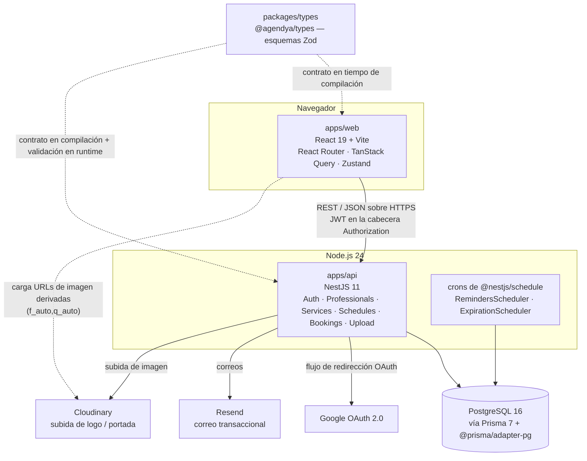

Agendya es un **monorepo de dos apps** más un paquete de contratos compartido:



## Camino de una petición

Toda petición que muta datos sigue el mismo camino por capas:

```
Usuario → componente React
        → hook del módulo (TanStack Query / RHF)
        → api.ts del módulo (apiClient: fetch + JWT)
        → Controller de NestJS  (ruta, ZodValidationPipe, guards)
        → Service de NestJS     (reglas de negocio, comprobaciones de política)
        → PrismaService         (consultas tipadas, transacciones)
        → PostgreSQL
```

Ver [Flujo de datos](/architecture/data-flow/) para un ejemplo completo (crear
una reserva) y [Arquitectura del backend](/architecture/backend/) para el
desglose de módulos.

## Repositorios y workspaces

| Workspace | Nombre del paquete | Stack | Propósito |
| --- | --- | --- | --- |
| `apps/api` | `api` | NestJS 11, Prisma 7, PostgreSQL | API REST, autenticación, tareas cron |
| `apps/web` | `web` | React 19, Vite, TS | Panel del profesional + reserva pública |
| `packages/types` | `@agendya/types` | Zod | Esquemas y constantes de petición/respuesta compartidos |

`apps/web/Agendya-main/` es una **exportación de diseño de Figma Make** que se
conserva solo como referencia. Está en `.gitignore` y no es la app en ejecución
— ver [Estructura del repositorio](/overview/repository-layout/).

## Características clave

- **Autenticación de API sin estado.** El JWT viaja en la cabecera
  `Authorization`, nunca en una cookie, así que `credentials` de CORS se
  mantiene en `false`. (La única cookie del sistema es la cookie efímera de
  `state` de OAuth para protección contra CSRF de login.)
- **Contrato primero.** La forma de un payload cambia primero en
  `packages/types`, luego en ambos consumidores. La API revalida cada
  cuerpo/query con el mismo esquema Zod en runtime vía `ZodValidationPipe`.
- **Correcto con las zonas horarias.** Cada profesional tiene una `timezone`
  IANA. La interpretación de hora de pared (horario de atención, «hoy») pasa por
  `common/utils/timezone.util.ts`; los instantes absolutos (`startAt`) se
  comparan directamente.
- **Escrituras de reserva seguras ante concurrencia.** Los commits de espacios y
  las reprogramaciones corren en transacciones `Serializable` con reintentos
  acotados ante fallo de serialización.
- **Degradación elegante de terceros.** Sin `RESEND_API_KEY` → los correos se
  registran en consola. Sin `CLOUDINARY_URL` → el endpoint de subida devuelve
  503. Sin credenciales de Google → la estrategia OAuth simplemente no se
  registra.
