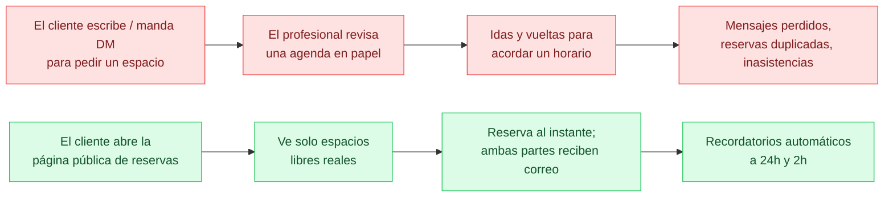

**Agendya** es una plataforma web de agendamiento. Un profesional se registra,
configura sus servicios y su horario de atención, y recibe una página pública de
reservas en `agendya.app/<slug>`. Sus clientes abren esa página, eligen uno o
más servicios, escogen un horario disponible y reservan — sin necesidad de
cuenta. Los correos de confirmación, recordatorio, reprogramación y cancelación
se envían automáticamente.

## Para quién es

La Fase 1 (el MVP actual) está dirigida a **barberos y peluqueros**: negocios de
un solo operador que necesitan una página de reservas online y una agenda
sencilla, no una suite completa de gestión de salón.

| Rol | ¿Tiene cuenta? | Qué hace |
| --- | --- | --- |
| **Profesional** | Sí (contraseña o Google) | Gestiona el perfil y la marca, los servicios, el horario semanal y las fechas bloqueadas; consulta y gestiona la agenda. |
| **Cliente** | No | Navega la página pública de un profesional, reserva un espacio y luego reprograma o cancela mediante un enlace con token. |

No hay una tabla `Customer` aparte — la identidad del cliente se captura como
campos de nombre / email / teléfono **fijados como snapshot en cada reserva**.
Ver [Datos y ciclo de vida de la cita](/database/appointment-lifecycle/).

## El problema que resuelve

## Conjunto de funcionalidades (Fase 1)

- **Autenticación** — email/contraseña (bcrypt) y Google OAuth 2.0, sesiones
  JWT. [Detalles](/features/authentication/)
- **Perfil del profesional y marca** — nombre del negocio, categoría,
  descripción, logo, imagen de portada, color de marca, zona horaria, ventana
  de política de cancelación, `slug` público. [Detalles](/features/professionals/)
- **Servicios** — nombre, duración, precio (en unidades menores enteras),
  variante a domicilio opcional con su propia duración/precio, orden, borrado
  lógico, duplicado. Límites según el plan. [Detalles](/features/services/)
- **Horario de atención** — hasta 6 bloques sin solapamiento por día de la
  semana. [Detalles](/features/schedule/)
- **Excepciones de horario** — fechas cerradas puntuales.
  [Detalles](/features/schedule/)
- **Disponibilidad** — cálculo de espacios libres basado en una grilla que
  respeta el horario de atención, las excepciones, las reservas existentes, la
  duración del servicio y la modalidad. [Detalles](/features/availability/)
- **Reserva pública** — asistente de varios pasos: servicios → fecha/hora →
  datos de contacto → confirmación. Admite reservas con varios servicios.
  [Detalles](/features/appointments/)
- **Agenda** — la lista de reservas del profesional por rango de fechas con
  estado y acciones de cancelar / completar / reprogramar.
  [Detalles](/features/agenda/)
- **Reprogramar y cancelar** — por el profesional desde la agenda, o por el
  cliente mediante el enlace con `cancellationToken`, ambos condicionados por la
  política de cancelación. [Detalles](/features/appointments/)
- **Correo transaccional** — confirmación, recordatorio (24h y 2h),
  reprogramación (al cliente y al profesional), cancelación. Se envía con
  Resend; se registra en consola cuando no está configurado.
  [Detalles](/features/notifications/)
- **Planes** — `FREE` / `BASIC` / `ADVANCED` / `BUSINESS`. Gratuito: 3
  servicios, 100 reservas/mes. Básico: 10 servicios, reservas ilimitadas.
  Flags en `FEATURE_CATALOG`. Se aplica en el servidor.

## Lo que *no* está en la Fase 1

La raíz del repositorio contiene documentos de planificación de fases
posteriores (`Fase-2-Retencion.md`, `Fase-3-Marketplace.md`,
`Fase-4-Negocios-WhatsApp.md`). Las herramientas de retención, un marketplace de
clientes, negocios con varios empleados, la integración con WhatsApp y los pagos
online están todos **fuera de alcance** y no implementados. No los documentes
como si existieran.

:::note[Sobre el nombre]
El producto se renombró de **Ronda** a **Agendya** al principio. La
configuración en vivo, los identificadores y CI ya se actualizaron; las
menciones a `Ronda` que quedan sobreviven solo en la prosa de planificación
escrita a mano (`Arquitectura-Tecnica.md`, `Stack-Tecnologico.md`, `MVP-v1.md`,
`Fase-4-*.md`), que se conserva como registro histórico.
:::
