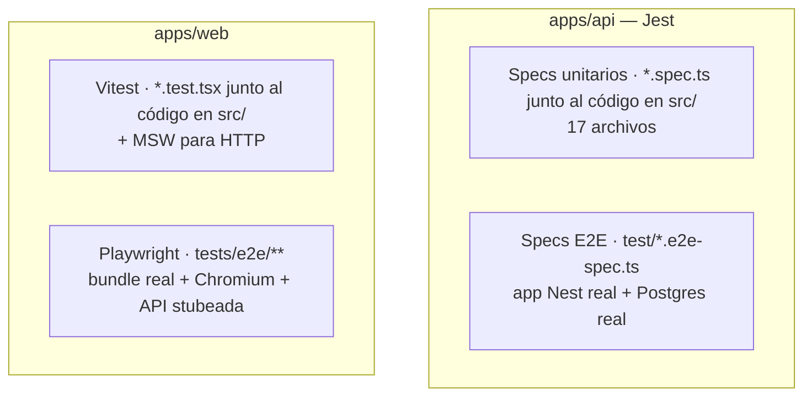

Agendya tiene **tres** capas de pruebas.



## API — Jest

La configuración está inline en `apps/api/package.json` (`rootDir: src`,
`testRegex: .*\.spec\.ts$`, `ts-jest`).

| Comando (desde `apps/api`) | Alcance |
| --- | --- |
| `npm run test` | Specs unitarios en `src/**` |
| `npm run test:watch` | Modo watch |
| `npm run test:cov` | Cobertura → `../coverage` |
| `npm run test:e2e` | `test/*.e2e-spec.ts` vía `test/jest-e2e.json`, `--runInBand` |

### Specs unitarios (`src/**/*.spec.ts`)

Lógica pura y comportamiento de servicios, en su mayoría sin una BD real:
`booking-policy.spec.ts`, `auth.service.spec.ts`, `bookings.service.spec.ts`,
`availability.service.spec.ts`, `schedules.service.spec.ts`,
`professionals.service.spec.ts`, `services.service.spec.ts`,
`reminders.scheduler.spec.ts`, `expiration.scheduler.spec.ts`,
`google-oauth-state.guard.spec.ts`, y los helpers de `common/utils`
(`slug`, `timezone`, `cors`), `infra/mail/html.util`, `mail.service`,
`infra/upload/upload.controller`, `app.controller`.

### Specs E2E (`test/*.e2e-spec.ts`)

Arrancan el `AppModule` real con `configureApp()` (mismo cableado que
`main.ts`) y golpean un **PostgreSQL real**. Ponen `DISABLE_SCHEDULED_JOBS=true`
para que las tareas cron no compitan con las transacciones serializables de
reserva.

| Archivo | Cubre |
| --- | --- |
| `app.e2e-spec.ts` | `GET /`, `GET /health` |
| `auth-professionals.e2e-spec.ts` | register/login/`/auth/me`, perfil GET/PATCH, `check-slug`, perfil público, validación de URL |
| `services.e2e-spec.ts` | CRUD, límites de plan, propiedad |
| `schedules.e2e-spec.ts` | horario de atención (reemplazo, multibloque, rechazo de solape), excepciones, disponibilidad pública |
| `bookings.e2e-spec.ts` | crear, rechazo de solape, búsqueda por token, cancelar/completar/reprogramar, ventana de política, **dos reservas concurrentes — solo una gana**, autosanado `CONFIRMED→EXPIRED`, dos reprogramaciones concurrentes |
| `security.e2e-spec.ts` | cabeceras de helmet, sin `X-Powered-By`, reglas de origen de CORS, rechazo de CSRF del `state` de OAuth |

## Web — Vitest

Configuración en `vite.config.ts` (`environment: jsdom`, `globals: true`,
`setupFiles: ['./src/test/setup.ts']`, excluye `tests/**`).

```bash
cd apps/web && npm run test          # modo run
```

Suites: `App.test.tsx`, `shared/image/cloudinary.test.ts`,
`shared/theme/themeStore.test.ts`, `modules/publicBooking/PublicBookingPage.test.tsx`,
`modules/publicBooking/BookingCancelPage.test.tsx`,
`modules/bookings/AgendaPage.test.tsx`,
`modules/schedules/SchedulePage.test.tsx`,
`modules/services/ServicesPage.test.tsx`.

El HTTP se intercepta con **MSW**. Testing Library maneja el DOM; las
aserciones vía `@testing-library/jest-dom`.

## Web — Playwright

Configuración `apps/web/playwright.config.ts`. `testDir: ./tests`, solo Chromium
(Firefox/WebKit comentados), `webServer` arranca/reutiliza el dev server de
Vite.

```bash
cd apps/web
npm run test:e2e:install   # una vez: descargar Chromium
npm run test:e2e           # headless
npm run test:e2e:ui        # modo UI
```

La API REST de Agendya se **stubea en el límite de red**
(`tests/fixtures/api.ts` — almacén en memoria + registrador de peticiones;
`api.overrideOnce(...)` para errores puntuales). Los hosts de terceros (Google,
Cloudinary, Resend) están bloqueados. `tests/auth.setup.ts` siembra la entrada
`agendya-auth` de `localStorage` en `playwright/.auth/user.json`; los specs de
panel se apuntan con `test.use({ storageState })`.

Specs: `smoke`, `auth/login`, `navigation/dashboard-nav`, `dashboard/profile`,
`dashboard/services`, `dashboard/agenda`, `theme/system-preference`,
`a11y/audit` (`@axe-core/playwright`), `public-booking/booking`.

## Convenciones

- **Unitario de API:** `*.spec.ts` junto al código; prefiere testear helpers
  puros (`booking-policy.ts`) directamente antes que a través del grafo de
  servicios.
- **E2E de API:** ejercita la superficie HTTP; nunca reimplementes
  `configureApp` — impórtalo.
- **Unitario web:** `*.test.tsx` junto al componente; mockea HTTP con MSW, no
  stubeando `apiClient`.
- **E2E web:** nunca golpees un backend real; agrega fixtures a
  `tests/fixtures/`.
- Mantén `npm run test` (raíz) en verde — es la puerta de CI junto con
  typecheck, lint, e2e y build.
